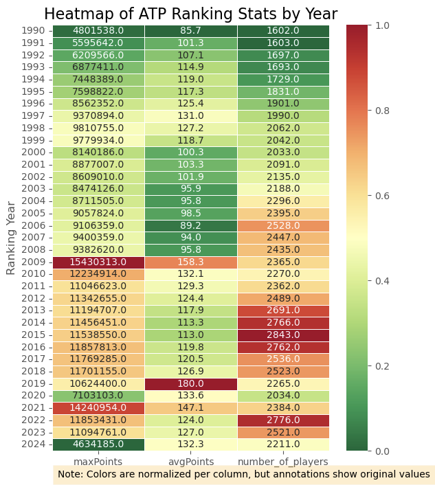
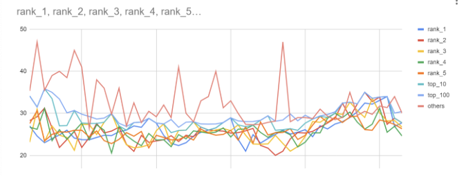
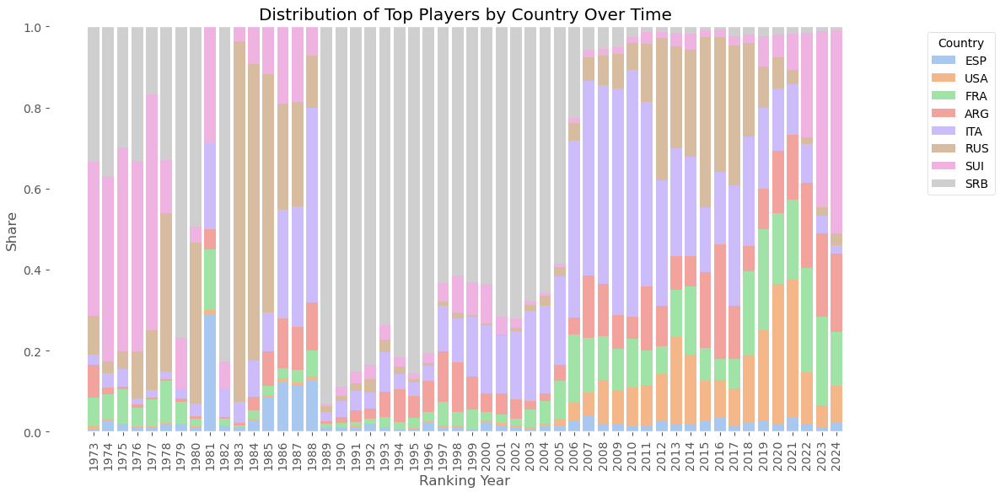

# Tennis Players Ranking - Pure SQL - EDA - Visualizing
# Project Background
This project using Exploratory Data Analysis to answer my curiousity about tennis players. My EDA using dataset from a comprehensive collection of ATP tennis rankings, match results, and player statistics from [Kaggle's dataset](https://www.kaggle.com/datasets/guillemservera/tennis). It is derived from the original database created and maintained by Jeff Sackmann. Original Work: Jeff Sackmann's Tennis ATP Database on GitHub. 
This is a micro side project driven by my personal curiosity, and at the same time it demonstrates my ability to perform analytical thinking, and translate raw sports data into meaningful visual insights—skills.

### Overview of Findings

- During the analysis, I initially explored questions such as “Who is the top player, and why?”, “Where is the true land of tennis?”, and “Is Italy?”. However, the data revealed insights that were more nuanced and more compelling than my original assumptions.

- Rather than pointing to a single dominant player or country, the findings highlight patterns of consistency, competitive depth, and long-term performance trends across nations and generations.

- Interestingly, the outcomes of this analysis have influenced the way I personally approach the game.
# Insights Deep Dive

## Importing data:
- Each query below represents an integration of SQL and Python to process and extract insights from the dataset. This approach allows me to quickly visualize results within a single analytical language (Python), ensuring both efficiency and consistency throughout the workflow.
In: 
```bash
import numpy as np 
import pandas as pd 
import sqlite3

import seaborn as sns 
import matplotlib
import matplotlib.pyplot as plt 
plt.style.use ('ggplot') 
from matplotlib.pyplot import figure 

%matplotlib inline 
matplotlib.rcParams ['figure.figsize'] = (12,8) # adjust the configuration of the plots we will create 

#Connect to the SQLite database 
conn = sqlite3.connect('/Downloads/archive/database.sqlite') 
```
In: 
```bash
# Create a cursor object 
cursor = conn.cursor ()

#Execute a query to fetch table names 
cursor.execute("SELECT name FROM sqlite_master WHERE type ='table';") 
tables = cursor.fetchall()

# Display table names 
print ("Tables in the database:") 
for table in tables: 
    print (table[0])
```
Out: 
```bash
Tables in the database:
matches
players
rankings
```
- This dataset contain 3 tables: matches, players, rankings, in which I will explore mostly in players and rankings. 
## Yearly attendance ( attendance trends) :

* **More and more players attending each years**

In:
```bash
# Query data from the 'players' table and display it using pandas 
query = "SELECT * FROM players LIMIT 5;" # fetch first 5 rows from the 'player' table 
df = pd.read_sql_query (query, conn)

#Display the DatatFrame 
print ("\nFirst 5 rows from the 'player' table:") 
print (df)
```
Out: 
```bash
First 5 rows from the 'player' table:
   player_id name_first name_last hand         dob  ioc  height wikidata_id
0     100001    Gardnar    Mulloy    R  19131122.0  USA   185.0      Q54544
1     100002     Pancho    Segura    R  19210620.0  ECU   168.0      Q54581
2     100003      Frank   Sedgman    R  19271002.0  AUS   180.0     Q962049
3     100004   Giuseppe     Merlo    R  19271011.0  ITA     NaN    Q1258752
4     100005    Richard  Gonzalez    R  19280509.0  USA   188.0      Q53554
```
In: 
```bash
# select the ranking year and count the number of distinct players for each year 
cursor = conn.cursor()
cursor.execute (""" CREATE TEMP TABLE glue AS 
SELECT 
Substr(cast(ranking_date as string), 1, 4) as ranking_year
, count(distinct player) as number_of_players, sum(points) as maxPoints
, avg(points) as avgPoints 
FROM rankings 
GROUP BY ranking_year 
ORDER BY ranking_year;""")
conn.commit()
print ("\nYearly players amount:") 
print (glue)
```
Out: 
```bash
Yearly players amount:
   ranking_year  number_of_players   maxPoints   avgPoints
0          1973                241         NaN         NaN
1          1974                415         NaN         NaN
2          1975                503         NaN         NaN
3          1976                454         NaN         NaN
4          1977                404         NaN         NaN
5          1978                688         NaN         NaN
6          1979                814         NaN         NaN
7          1980                506         NaN         NaN
8          1981                146         NaN         NaN
9          1982                433         NaN         NaN
10         1983               1044         NaN         NaN
11         1984               1301         NaN         NaN
12         1985               1335         NaN         NaN
13         1986               1397         NaN         NaN
14         1987               1476         NaN         NaN
15         1988               1532         NaN         NaN
16         1989               1605         NaN         NaN
17         1990               1602   4801538.0   85.677492
18         1991               1603   5595642.0  101.342787
19         1992               1697   6209566.0  107.059637
20         1993               1693   6877411.0  114.935759
21         1994               1729   7448389.0  118.955346
22         1995               1831   7598822.0  117.289302
23         1996               1901   8562352.0  125.422628
24         1997               1990   9370894.0  131.017477
25         1998               2062   9810755.0  127.164679
26         1999               2042   9779934.0  118.730306
27         2000               2033   8140186.0  100.298004
28         2001               2091   8877007.0  103.307502
29         2002               2135   8609010.0  101.934854
30         2003               2188   8474126.0   95.945812
31         2004               2296   8711505.0   95.771869
32         2005               2395   9057824.0   98.472805
33         2006               2528   9106359.0   89.155659
34         2007               2447   9400359.0   94.021454
35         2008               2435   9382620.0   95.754700
36         2009               2365  15430313.0  158.301834
37         2010               2270  12234914.0  132.078006
38         2011               2362  11046623.0  129.275869
39         2012               2489  11342655.0  124.357581
40         2013               2691  11194707.0  117.879969
41         2014               2766  11456451.0  113.330343
42         2015               2843  11538550.0  112.982365
43         2016               2762  11857813.0  119.760163
44         2017               2536  11769285.0  120.540005
45         2018               2523  11701155.0  126.852789
46         2019               2265  10624400.0  180.028806
47         2020               2034   7103103.0  133.624979
48         2021               2384  14240954.0  147.086904
49         2022               2776  11853431.0  123.966523
50         2023               2521  11094761.0  127.019371
51         2024               2211   4634185.0  132.288116
```
- Now we can see that even though the range we're working with is from 1973, rankings only appear in the dataset as of 1990, and some indicates: number of players, average points and sum of ranking per year,are going up. 
- Personally, I think it's much better to visualize the trends and any findings 


## Which player are mostly ranked first?

* **Create a temporary table for yearly ranking.**

In: 
```bash
cursor = conn.cursor ()
cursor.execute(""" CREATE TEMP TABLE ranking_enriched AS 
SELECT *, Substr(cast(ranking_date as string), 1, 4) as ranking_year FROM rankings ;""")
conn.commit()
print (ranking_enriched)
```

Out 
```bash
ranking_date  rank  player  points ranking_year
0            20000110     1  101736  4135.0         2000
1            20000110     2  102338  2915.0         2000
2            20000110     3  101948  2419.0         2000
3            20000110     4  103017  2184.0         2000
4            20000110     5  102856  2169.0         2000
...               ...   ...     ...     ...          ...
3235634      19771212    95  100586     NaN         1977
3235635      19771212    97  100363     NaN         1977
3235636      19771212    98  100176     NaN         1977
3235637      19771212    99  100233     NaN         1977
3235638      19771212    99  100359     NaN         1977

[3235639 rows x 5 columns]
```

In: 

```bash
cursor = conn.cursor()

cursor.execute("""
CREATE TEMP TABLE ranked_players AS
SELECT player
,count (*) as ranked_first
,count(distinct Substr(cast(ranking_date as string), 1, 4)) as years_first 
FROM rankings 
WHERE rank = 1 GROUP BY player ORDER BY ranked_first desc 
LIMIT 10
""")

conn.commit()

print ("\Top 10 players:")
print (ranked_players)
```

Out: 
```bash
\Top 10 players:
   player  ranked_first  years_first
0  104925           377           13
1  103819           307            9
2  101948           285            8
3  100656           228            8
4  104745           193           10
5  100581           136            6
6  100284           104            8
7  101736           100            5
8  100437            94            4
9  103720            80            3
```
- Now we know who is the top players, but we haven't know their name.

In: 
```bash
query = """SELECT p.name_first||" "|| p.name_last as player_name
                , r.ranked_first 
                ,r.years_first
FROM ranked_players as r 
LEFT JOIN players as p
ON r.player = p.player_id; """
ranked_playerss = pd.read_sql_query (query,conn) 
print ("\Top 10 players:")
print (ranked_playerss) 
```
Out: 
```bash
\Top 10 players:
      player_name  ranked_first  years_first
0  Novak Djokovic           377           13
1   Roger Federer           307            9
2    Pete Sampras           285            8
3      Ivan Lendl           228            8
4    Rafael Nadal           193           10
5    John McEnroe           136            6
6   Jimmy Connors           104            8
7    Andre Agassi           100            5
8      Bjorn Borg            94            4
9  Lleyton Hewitt            80            3
```
- Novak Djokovic - a legends - hmm, my first racket is Wilson, but my next one will be Head - cool!
## Age Analysis

- In the players table, there are more columns that we could use for more interesting analysis, especially the age data, to answer question " Is being young the secret to become winner?".

In: 
```bash
cursor = conn.cursor()

cursor.execute("""
CREATE TEMP TABLE zxc AS
SELECT  r.ranking_year
        ,r.points 
        ,r.rank, p.*, p.name_first||" "||p.name_last as player_name
FROM  ranking_enriched as r
LEFT JOIN players as p ON p.player_id = r.player
Group by r.points
order by r.points;
""")

conn.commit()
```

In: 
```bash
cursor = conn.cursor ()
cursor.execute ("""
CREATE TEMP TABLE ranked_age AS 
SELECT
    ranking_year,
    AVG(ranking_year - CAST(SUBSTR(dob, 1, 4) AS INT)) AS average_age
FROM
    zxc
WHERE rank = 1
GROUP BY
    ranking_year
order by ranking_year asc;""")
print(ranked_age)
```
Out: 
```bash
ranking_year  average_age
0          1973    27.000000
1          1974    24.600000
2          1975    23.000000
3          1976    24.000000
4          1977    24.875000
5          1978    26.000000
6          1979    24.128205
7          1980    23.733333
8          1981    23.714286
9          1982    24.272727
10         1983    24.790698
11         1984    24.697674
12         1985    25.642857
13         1986    26.000000
14         1987    27.000000
15         1988    26.666667
16         1989    28.813953
17         1990    27.692308
18         1991    24.769231
19         1992    22.846154
20         1993    22.326923
21         1994    23.000000
22         1995    24.576923
23         1996    25.490566
24         1997    26.000000
25         1998    26.538462
26         1999    27.807692
27         2000    28.941176
28         2001    23.811321
29         2002    21.000000
30         2003    24.942308
31         2004    22.923077
32         2005    24.000000
33         2006    25.000000
34         2007    26.000000
35         2008    25.076923
36         2009    25.500000
37         2010    26.115385
38         2011    24.456522
39         2012    27.042553
40         2013    26.282609
41         2014    27.456522
42         2015    28.000000
43         2016    29.000000
44         2017    30.382979
45         2018    32.446809
46         2019    32.191489
47         2020    33.111111
48         2021    34.000000
49         2022    26.891304
50         2023    30.418605
51         2024    37.000000
```

- Answer: NO, the average age of the number 1 player goes up over the years,this means age is not the main ingredient for winning and could also mean that the legends are just aging!


* **Booms**
Some interesting facts!


## Who achieve the top1 player earliest?


In:
```bash
cursor = conn.cursor()

cursor.execute("""
CREATE TEMP TABLE RankedPlayers AS
WITH RankedPlayers AS (
    SELECT
        ranking_year,
        player_name,
        ranking_year - CAST(SUBSTR(dob, 1, 4) AS INT) AS age,
        ROW_NUMBER() OVER(PARTITION BY ranking_year, player_name ORDER BY ranking_year ASC) AS rn
    FROM
        zxc
    WHERE rank = 1
)

SELECT
    ranking_year,
    player_name,
    age
FROM
    RankedPlayers
WHERE rn = 1
ORDER BY age ASC
LIMIT 10;
""")

# Query the existing table 
cursor = conn.cursor ()
cursor.execute("SELECT * FROM RankedPlayers")

# Use pandas to display the results
df = pd.read_sql_query("SELECT * FROM RankedPlayers", conn)
print(df)
```
Out: 

```bash
ranking_year     player_name  age
0         2022  Carlos Alcaraz   19
1         2000     Marat Safin   20
2         2001  Lleyton Hewitt   20
3         2023  Carlos Alcaraz   20
4         1977      Bjorn Borg   21
5         1980    John McEnroe   21
6         2001     Marat Safin   21
7         2002  Lleyton Hewitt   21
8         2003    Andy Roddick   21
9         1974   Jimmy Connors   22
```


* **Uwwee >.<!** the year of 2025 grew my inspo to tennis because of Jannik Sinner, and mostly the macthes between him and Carlos Alcaraz - cool!

## Handstyle:

My forehand mostly from the right,but I feel more confident when using my backhand as in the left. So I'm thinking about changing the forehand if there's any potential for this investment?!

### Which handside is played by top players the most?.

In: 
```bash
cursor = conn.cursor()

cursor.execute("""
CREATE TEMP TABLE handplay AS
select hand, count(*) as cases, avg(rank) as ranking_by_hand
from zxc
group by hand
limit 10;
""")

cursor = conn.cursor ()
cursor.execute("SELECT * FROM handplay")
df = pd.read_sql_query("SELECT * FROM handplay", conn)
print(df)
```

Out: 
```bash
hand    cases  ranking_by_hand
0  None      132      1564.613636
1     A     2833       657.063537
2     L   280721       674.141439
3     R  2252681       731.679624
4     U   699272      1267.496626
```

-  It doesn't look like that left handed players have an adventage when in the match as we can see the average ranking is lower than right handed players!
-  But, should we look at any differences between the likeliness of being a lefty or a righty by ranking?

In: 
```bash
cursor = conn.cursor ()
cursor.execute("""
CREATE TEMP TABLE lefthand AS
SELECT
    rank,
    (sum(CASE WHEN hand = 'L' THEN 1 ELSE 0 END) / CAST(count(*) AS REAL)) * 100 AS lefties_percentage
FROM
    zxc
WHERE rank < 10
GROUP BY
    rank
LIMIT 10;
""")
cursor = conn.cursor ()
cursor.execute("SELECT * FROM lefthand")
df = pd.read_sql_query("SELECT * FROM lefthand", conn)
print(df)
```

Out: 
```bash
rank  lefties_percentage
0     1           19.804183
1     2           31.111111
2     3           19.340463
3     4           14.864263
4     5           15.829257
5     6           15.768374
6     7           12.277580
7     8            9.617097
8     9           13.555556
```

- Nope, it's skewed through data, so furthur analysis of others differences should helped more. 

## Location:
### Top 1 competitive countries.
-  I wonder, which countries have the most competitive players in total? so I will look at the total points through out the years.

In: 
```bash
cursor = conn.cursor()

cursor.execute("""
CREATE TEMP TABLE zxcjd AS
SELECT  r.ranking_year
        ,r.points 
        ,r.rank, p.*, p.name_first||" "||p.name_last as player_name
FROM  ranking_enriched as r
LEFT JOIN players as p ON p.player_id = r.player
""")

conn.commit()


cursor = conn.cursor()
cursor.execute("""
CREATE TEMP TABLE countrypoints AS
SELECT ioc, sum(points) as country_points  -- Changed 'points' to 'point' assuming the column is named 'point'
FROM zxcjd
GROUP BY ioc
ORDER BY country_points desc
limit 10;
""")
# Let's see which countries have the most points
cursor = conn.cursor ()
cursor.execute("SELECT * FROM countrypoints")
df = pd.read_sql_query("SELECT * FROM countrypoints", conn)
print(df)
```

Out: 
```bash
ioc  country_points
0  ESP      36793743.0
1  USA      33538077.0
2  FRA      26570241.0
3  GER      19830850.0
4  ARG      19049895.0
5  ITA      15012498.0
6  RUS      13703189.0
7  AUS      13322279.0
8  SUI      11696039.0
9  SRB      11587096.0
```

- Spain is the country that have the most points, no wonder many lengends come from this land.

### Let's put more trend!

In: 
```bash
cursor = conn.cursor()
cursor.execute("""
CREATE TEMP TABLE player_country AS
SELECT
    ranking_year,
    MAX(CASE WHEN ioc = 'ESP' THEN highest_ranked_player END) AS ESP,
    MAX(CASE WHEN ioc = 'USA' THEN highest_ranked_player END) AS USA,
    MAX(CASE WHEN ioc = 'FRA' THEN highest_ranked_player END) AS FRA,
    MAX(CASE WHEN ioc = 'ARG' THEN highest_ranked_player END) AS ARG,
    MAX(CASE WHEN ioc = 'ITA' THEN highest_ranked_player END) AS ITA,
    MAX(CASE WHEN ioc = 'RUS' THEN highest_ranked_player END) AS RUS,
    MAX(CASE WHEN ioc = 'SUI' THEN highest_ranked_player END) AS SUI,
    MAX(CASE WHEN ioc = 'SRB' THEN highest_ranked_player END) AS SRB    
FROM (
    SELECT
        ioc,
        ranking_year,
        MIN(rank) AS highest_ranked_player
    FROM
        zxcjd
    WHERE ioc IN ('ESP', 'USA','FRA','GER','ARG','ITA','RUS','AUS','SUI','SRB')
    GROUP BY
        ioc, ranking_year
) subquery
GROUP BY
    ranking_year
ORDER BY
    ranking_year;
""")

cursor = conn.cursor ()
cursor.execute("SELECT * FROM player_country")
df = pd.read_sql_query("SELECT * FROM player_country", conn)
print(df)
```
Out: 
```bash
ranking_year  ESP  USA  FRA  ARG  ITA    RUS  SUI     SRB
0          1973    2    3   23   27    8   32.0  126   111.0
1          1974    9    1   20    5   12    9.0  148   121.0
2          1975    5    1   26    2   14   13.0  156    92.0
3          1976    4    1   19    3    6   47.0  190   134.0
4          1977    4    1   27    2    7   60.0  234    68.0
5          1978    7    1   38    2    7  144.0   48   122.0
6          1979    7    1   22    3   10    NaN   51   312.0
7          1980    7    1   12    4   19  249.0   24   309.0
8          1981   23    1   12    4   17    NaN   23     NaN
9          1982    7    1    9    2   39    NaN   36   450.0
10         1983    6    1    4    4   35  616.0   25     NaN
11         1984    7    1    5    8   22  180.0   23     NaN
12         1985   19    1    5   19   21  131.0   26     NaN
13         1986   14    1    3   14   31   30.0   22     NaN
14         1987   14    1    4   13   37   32.0   23     NaN
15         1988   14    1    7   13   53   14.0    8     NaN
16         1989   13    1    9    8   26   17.0    7  1103.0
17         1990    7    1    9   10   31   10.0   17   684.0
18         1991    5    2    4   14   24    9.0   14   413.0
19         1992    8    1    6   11   18   15.0   17   383.0
20         1993    4    1   10   27   42   14.0   15   317.0
21         1994    3    1    9   48   21   11.0   14   474.0
22         1995    4    1   14   30   18    4.0    9   473.0
23         1996   11    1   12   37   19    3.0   12   394.0
24         1997    4    1   20   43   39    3.0   16   218.0
25         1998    3    1   10   35   31    4.0   26   176.0
26         1999    1    1   13   23   41    1.0   23   176.0
27         2000    6    1    5   11   42    1.0   24   157.0
28         2001    4    2    6   14   40    1.0   12   200.0
29         2002    2    2    4   12   43    2.0    6   183.0
30         2003    1    1    9    4   44    3.0    2   134.0
31         2004    2    1    9    3   35    4.0    1   106.0
32         2005    2    2   12    5   28    3.0    1    75.0
33         2006    2    3   12    3   31    3.0    1    16.0
34         2007    2    3    7    8   25    3.0    1     3.0
35         2008    1    6    6    7   27    4.0    1     3.0
36         2009    1    5    6    5   33    5.0    1     3.0
37         2010    1    7    9    4   45    5.0    1     2.0
38         2011    1    7    6   11   32   10.0    2     1.0
39         2012    2    8    5    7   22   25.0    1     1.0
40         2013    1   13    7    5   16   15.0    2     1.0
41         2014    1    9    9    4   13   14.0    2     1.0
42         2015    3   11    9   21   18   47.0    2     1.0
43         2016    4   11    6   33   21   39.0    2     1.0
44         2017    1    8    6   11   25   29.0    2     2.0
45         2018    1    8   10    3   13   11.0    1     1.0
46         2019    1    9   10    4    8    4.0    3     1.0
47         2020    1   18    9    8    8    4.0    3     1.0
48         2021    2   19   11    9    7    2.0    5     1.0
49         2022    1    8   16   13    6    1.0   16     1.0
50         2023    1    5   20   19    4    2.0   40     1.0
51         2024    2    9   13   19    2    3.0   49     1.0

```

### Done. And visualized it! 
In: 
```bash 
df = pd.read_sql_query("SELECT * FROM player_country", conn)
df = df.sort_values("ranking_year") 
countries = ["ESP", "USA", "FRA", "ARG", "ITA", "RUS", "SUI", "SRB"]

# Check if SRB exists in the dataframe
print("Columns in dataframe:", df.columns.tolist())
print("SRB data sample:", df["SRB"].head() if "SRB" in df.columns else "SRB column not found")

# Fill NaN values with 0 to ensure all countries have values
for country in countries:
    if country in df.columns:
        df[country] = df[country].fillna(0)
    else:
        print(f"Warning: {country} not found in dataframe columns")

df_prop = df.copy()
# Avoid division by zero by adding a small epsilon
df_prop[countries] = df_prop[countries].div(df_prop[countries].sum(axis=1) + 1e-10, axis=0)

plt.figure(figsize=(12, 6))

bottom = np.zeros(len(df_prop))

for country in countries:
    if country in df.columns:
        plt.bar(
            df_prop["ranking_year"],
            df_prop[country],
            bottom=bottom,
            label=country,
            width=0.8
        )
        bottom += df_prop[country].values

plt.xlabel("Ranking Year")
plt.ylabel("Share")
plt.title("Distribution of Top Players by Country Over Time")
plt.legend(title="Country", bbox_to_anchor=(1.05, 1), loc="upper left")

# Ensure all years are displayed on x-axis
all_years = sorted(df_prop["ranking_year"].unique())
plt.xticks(all_years, rotation=90)

plt.grid(axis='y', linestyle='--', alpha=0.7)
plt.tight_layout()
plt.show()
```
Out: 
```bash
Columns in dataframe: ['ranking_year', 'ESP', 'USA', 'FRA', 'ARG', 'ITA', 'RUS', 'SUI', 'SRB']
SRB data sample: 0    111.0
1    121.0
2     92.0
3    134.0
4     68.0
Name: SRB, dtype: float64
```

(Well, I did a bit changing colour. So for detailed changing, please take a look at this (notebook)[https://github.com/Ensya/Tennis-Players-Ranking/blob/main/Tenniss.ipynb]


# Recommendations:

- This is a work in progress and further investigation on the matches table would be interesting! Stay tuned >.-! as this table has a wealth of data I would love to explore & potentially create predictions algorithms to guess the winner.

